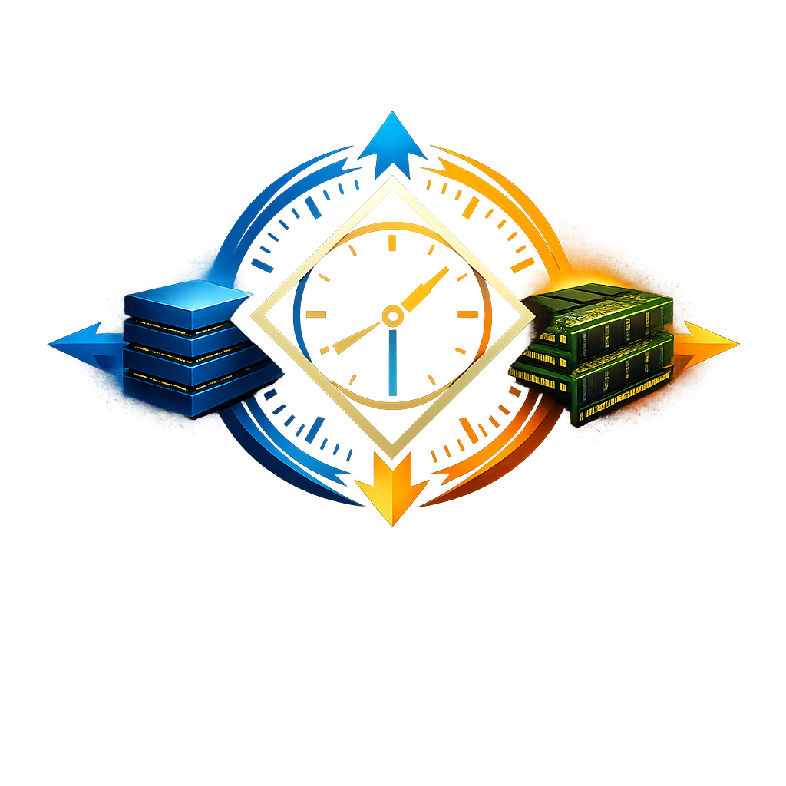

<p align="center">
  
</p>

<p align="center">
  
  
  
  
  
  
</p>

<h1 align="center">Kairos (καιρός)</h1>

<p align="center">
  <strong>Timing the Descent and Ascent of KV Cache</strong><br/>
  LLM 추론 서빙에서 KV cache의 메모리 계층 간 이동을 최적화하는 연구 프로젝트
</p>

---

## What is Kairos?

Kairos는 LLM 추론 시스템에서 KV cache를 **언제 내리고, 언제 올리고, 어디로 보낼 것인가**라는 타이밍 문제에 답하기 위한 연구 프로젝트입니다.

그리스 철학에서 Kairos는 "적절한 때"를 뜻합니다. 크로노스(Chronos, 물리적 시간)와 대비되는 "결정적 순간"이라는 의미가 KV cache 오프로딩 연구의 본질과 정확히 맞닿아 있습니다.

```
"이 KV 블록은 지금 HBM에 있어야 하는가, 내려도 되는가?"
"다음 forward pass 전에 어떤 블록을 다시 올려야 하는가?"
"이 워크로드에는 DRAM이 맞는가, SSD가 맞는가, CXL이 맞는가?"

→ 측정: torch.profiler, Nsight, PCIe 전송량   (Chronos)
→ 판단: 프리페치 타이밍, 티어링 정책           (Kairos)
→ 검증: Kairos Bench로 전략 간 통일 조건 비교
```

### Why Kairos?

| 기존 오프로딩 연구 | Kairos |
|:------------------:|:------:|
| 논문마다 다른 벤치마크 | **통일 조건 비교 프레임워크** |
| 알고리즘 제안 중심 | **도구 중심 접근 (Tool-Centric)** |
| 단일 전략 최적화 | **워크로드별 adaptive 전략** |
| CXL 실험 수작업 | **파라미터 기반 에뮬레이터** |
| 재현 불가능한 수치 | **재현 가능한 실험 스크립트** |

---

## Research Scope

Kairos가 집중하는 레이어는 **Inference Serving Engine**과 **Memory Hierarchy**입니다. 모델 아키텍처나 CUDA 커널, 리눅스 커널은 연구 범위 밖입니다.

```
┌───────────────────────────────────────────────────────┐
│  [Applications]         ChatGPT, Claude, 사내 LLM     │
├───────────────────────────────────────────────────────┤
│  [Orchestration]        Dynamo, llm-d, aibrix         │
├───────────────────────────────────────────────────────┤
│  [Serving Engine]       vLLM, SGLang, TensorRT-LLM    │ ◄── 주 타겟
├───────────────────────────────────────────────────────┤
│  [Compute Framework]    PyTorch, FlashAttention       │
├───────────────────────────────────────────────────────┤
│  [Memory Hierarchy]     HBM → DRAM → CXL → SSD        │ ◄── 확장 타겟
└───────────────────────────────────────────────────────┘
```

### Memory Hierarchy

```
디바이스       대역폭       지연       용량          역할
─────────────────────────────────────────────────────────────
GPU HBM      수 TB/s      매우 낮음    80–192GB     핫 (활성 KV)
Host DRAM    ~100 GB/s    낮음        128GB–2TB    웜 (swap)
CXL 메모리   ~80 GB/s     중간        TB 단위       웜/콜드 (확장)
NVMe SSD     ~7 GB/s      높음        TB 단위       콜드 (아카이브)
```

---

## Kairos Bench

단순히 오프로딩 알고리즘을 제안하는 대신, **오프로딩 전략을 테스트하고 비교하기 쉽게 만드는 도구**를 먼저 만듭니다. 이 도구가 vLLM 생태계 기여 · 연구 실험 · 논문을 동시에 해결합니다.

```
┌──────────────────────────────────────────────────────────┐
│                      Kairos Bench                         │
│                                                           │
│  ┌────────────────────────────────────────────────────┐  │
│  │ Module 1: Offloading Strategy Comparison Framework │  │
│  │   • 전략 플러그인 인터페이스 (vLLM 내장/LMCache/   │  │
│  │     layerwise 등 교체 가능)                        │  │
│  │   • 표준 워크로드 러너 (ShareGPT/LongBench/RULER)  │  │
│  │   • 재현 가능한 실험 스크립트                      │  │
│  └────────────────────────────────────────────────────┘  │
│                                                           │
│  ┌────────────────────────────────────────────────────┐  │
│  │ Module 2: KV Cache Access Pattern Profiler         │  │
│  │   • 레이어별/블록별 접근 타이밍 트레이싱           │  │
│  │   • 워크로드별 핫/콜드 분포 시각화                 │  │
│  │   • 전략 설계에 직접 쓸 수 있는 분석 데이터        │  │
│  └────────────────────────────────────────────────────┘  │
│                                                           │
│  ┌────────────────────────────────────────────────────┐  │
│  │ Module 3: Memory Tier Emulator (Phase 4)           │  │
│  │   • 대역폭/지연 파라미터 기반 throttling           │  │
│  │   • vLLM 오프로딩 커넥터 백엔드 인터페이스         │  │
│  │   • CXL/느린 SSD sweep 실험 자동화                 │  │
│  └────────────────────────────────────────────────────┘  │
└──────────────────────────────────────────────────────────┘
```

---

## Phase Roadmap

| Phase | 기간 | 목표 | 산출물 |
|:-----:|:----:|------|--------|
| **0** | 12–16주 | PyTorch + 트랜스포머 + KV cache 직접 구현 · 핵심 논문 8편 리딩 | Deep Trace Documents, KV cache 구현 코드 |
| **1** | 10–14주 | vLLM 코드베이스 이해 · 오픈소스 기여 · Pain Point 수집 | PR merged · Pain Point 10+ |
| **2** | 14–18주 | Kairos Bench 개발 · 비교 실험 · arXiv 프리프린트 | Kairos Bench · arXiv 논문 |
| **3** | 8–12주 | 워크숍 논문 제출 · 공동 연구자 확보 | 워크숍 제출 · 협업 관계 |
| **4** | 16–24주 | CXL 확장 · 정식 학회 풀 페이퍼 | EuroSys / ATC / SoCC |

---

## Current Status

**Phase 0 — Foundation (진행 예정)**

```
✓ 프로젝트 플랜 수립 (docs/kairos-project-plan.md)
✓ 디렉토리 스캐폴딩 (docs/ experiments/ notes/)
✓ GitHub 퍼블릭 공개
☐ 개발 환경 셋업 (Ubuntu 24.04 LTS + CUDA + PyTorch)
☐ Step 0-1: PyTorch 기초 (2주)
☐ Step 0-2: 트랜스포머 + KV cache 직접 구현 (3-4주)
☐ Step 0-3: 핵심 논문 8편 Deep Trace (4-6주)
☐ Step 0-4: GPU 메모리 계층 + 프로파일링 (2주)
```

---

## Target Papers (Phase 0 Reading List)

**추론 서빙 기초**
- Orca (Yu et al., 2022) — Continuous Batching
- vLLM / PagedAttention (Kwon et al., 2023) — 페이징 기반 KV cache 관리
- SGLang / RadixAttention (Zheng et al., 2024) — Prefix KV cache 재활용
- SpecInfer (Miao et al., 2023) — Draft-then-verify

**KV Cache 최적화**
- FlexGen (Sheng et al., 2023) — GPU-CPU-SSD 3-tier 오프로딩
- ShadowKV (Sun et al., 2024) — Sparse attention + offloading
- InfiniGen (Lee et al., 2024) — 부분 KV prefetch
- ScoutAttention (2026, DAC) — GPU-CPU 협업 attention

각 논문은 Deep Trace Document 형식으로 정리됩니다: 문제 정의 · 핵심 아이디어 · 시스템 아키텍처 · 실험 셋업 · 핵심 수치 · 한계점.

---

## Experimental Environment

| 항목 | 사양 |
|------|------|
| **GPU** | NVIDIA RTX 4060 Ti 8GB (Ada Lovelace) |
| **DRAM** | 64GB DDR5 |
| **OS** | Ubuntu 24.04 LTS |
| **Python** | 3.12+ (uv 관리) |
| **모델** | Llama-2-7B, Qwen2-7B (4-bit quantization) |
| **벤치마크** | ShareGPT, LongBench, RULER |
| **프로파일링** | torch.profiler · nvidia-smi · Nsight Systems |

> **단일 GPU + 8GB VRAM 구성은 Kairos 연구에 오히려 유리합니다.** VRAM이 빡빡할수록 KV cache 오프로딩의 임계점에 빠르게 도달하여 실험이 의미를 갖습니다. 64GB DRAM은 오프로딩 목적지로 이상적인 조건입니다.

---

## Project Structure

```
kairos/
├── docs/
│   └── kairos-project-plan.md    # 전체 프로젝트 플랜 (Phase 0–4)
├── experiments/                   # Phase 0–1 실습 코드
│   └── (PyTorch, KV cache, vLLM 벤치)
├── notes/                         # 주간 작업 로그, 아이디어 메모
├── CLAUDE.md                      # Claude 세션용 맥락 요약
├── README.md                      # 본 문서
└── logo.png
```

Phase 2 진입 시 `kairos-bench/`를 분리 생성하거나 별도 오픈소스 레포지토리로 독립시킵니다.

---

## Design Principles

### 1. Tool Before Algorithm

알고리즘을 먼저 제안하는 대신, 알고리즘을 **비교하는 도구**를 먼저 만듭니다. 도구 자체가 논문이 되고, 다른 연구자가 사용하면 인용이 쌓이며, 공동 연구자가 도구를 통해 자연스럽게 발견됩니다.

### 2. Workshop First, Top-Tier Later

첫 논문은 MLSys/ASPLOS/ISCA 워크숍 + arXiv 프리프린트를 타겟으로 합니다. 채택률 15–20%의 Top-Tier 학회는 Phase 4 이후 EuroSys/ATC/SoCC로 접근합니다.

### 3. Relative Comparison Over Absolute Numbers

단일 GPU 환경에서는 논문들과 절대 수치 비교가 어렵습니다. 대신 **전략 A vs 전략 B의 상대 비교**를 프레이밍의 중심에 둡니다.

### 4. Emulation-Justified Experiments

CXL 실물 하드웨어 없이 에뮬레이션 기반 실험을 수행합니다. 실물 대비 최대 26% 지연 차이는 논문에 명시하되, "에뮬레이션에서도 효과 있으니 실물에서는 더 좋을 것"이라는 스토리로 활용합니다.

### 5. Pain Point Driven Design

Phase 1에서 vLLM에 기여하면서 체감한 불편함(Pain Point)을 기록하고, Kairos Bench의 요구사항으로 직접 전환합니다. 연구 질문을 찾는 리스크를 도구 설계로 해결합니다.

---

## Related Ecosystem

| 프로젝트 | 역할 | Kairos 관계 |
|---------|------|-------------|
| **vLLM** | 추론 서빙 엔진 (de facto) | 주 기여 대상 · Kairos Bench 호스트 |
| **SGLang** | RadixAttention 기반 엔진 | 비교 연구 대상 |
| **LMCache** | 3-tier KV 캐시 시스템 | 오프로딩 전략 비교 대상 |
| **llm-d** | K8s 네이티브 분산 추론 | Phase 4 확장 가능성 |
| **emucxl / CXLMemSim** | CXL 에뮬레이션 | Phase 4 실험 인프라 |

---

## Documentation

| 문서 | 내용 |
|------|------|
| [docs/kairos-project-plan.md](docs/kairos-project-plan.md) | 전체 프로젝트 플랜 (Phase 0–4 상세 커리큘럼, 논문 리스트, 리스크 관리) |
| [CLAUDE.md](CLAUDE.md) | Claude Code 세션용 프로젝트 맥락 요약 |

---

## License

MIT

---

<p align="center">
  <sub>"적절한 때에 적절한 곳으로" — καιρός</sub>
</p>
